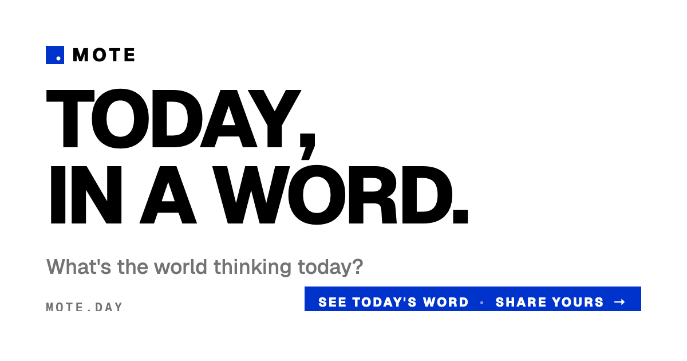

# Mote

> **One word per person, per day. The world's words, set big.**

A daily word ritual. Each visitor types one word about their day, and the world's words gather into a live cloud — bigger when more people say the same thing. The canvas resets at 00:00 UTC, and yesterday slips into the history view.

🌐 [mote.day](https://mote.day) · 📜 [MIT](LICENSE)

## Why

Twitter feeds are loud, polls are leading, and "how are you?" expects "fine." Mote asks for one word and shows you the planet's mood at a glance. No accounts, no comments, no algorithm — just a word and a shared canvas.

## How it works

- One submission per device per day, enforced both by a unique DB index and an RLS policy.
- Word size on the canvas scales with how many people said it.
- The cloud refreshes every ~25 seconds and on tab focus.
- Your own word stays pinned for 24 hours so it survives the UTC reset.
- A history view (last 7 days, single-day breakdown) lives behind the **History** button.

## Build it yourself

The whole site is one static `index.html` plus a Supabase schema. No bundler, no framework.

1. Create a Supabase project, run [`schema.sql`](schema.sql) in the SQL editor.
2. In `index.html`, replace `SUPABASE_URL` and `SUPABASE_ANON_KEY` with yours.
3. Serve the directory: `python3 -m http.server 8000`.
4. Deploy by uploading the folder to any static host. The live site uses Cloudflare Pages: `npx wrangler pages deploy . --project-name=mote --branch=main`.

A few things worth knowing: the `^[a-z]{1,20}$` constraint blocks non-Latin scripts and is a real limitation. The profanity filter is a small inline wordlist. Aggregation goes through the `word_counts` view to dodge PostgREST's 1000-row cap. The publishable key in the source is the anon key — RLS does the work.

## Contributing

Issues and PRs welcome. Open an issue before a large change so we can talk through scope. Keep the no-build, single-`index.html` shape — adding a bundler is a non-goal. New copy should be terse and human; read it aloud before shipping.

---

[MIT](LICENSE) © 2026 linhtt. Type by [Geist](https://vercel.com/font). Hosted on [Cloudflare Pages](https://pages.cloudflare.com/), backed by [Supabase](https://supabase.com).
